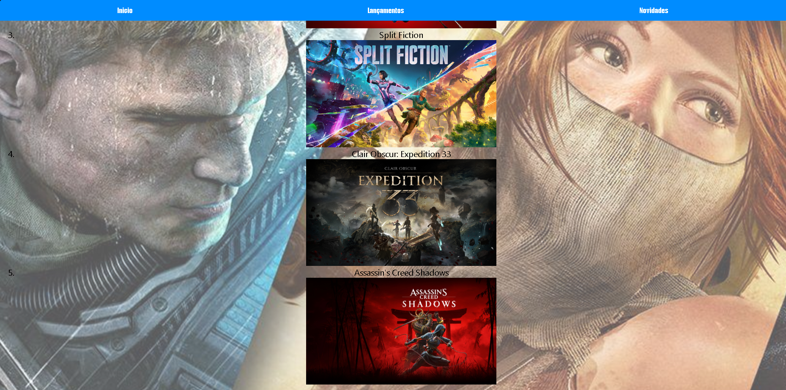
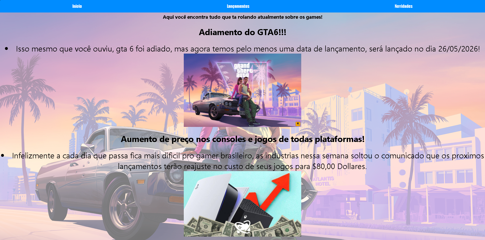

# 🎮 Landing Page 

Este foi um dos meus primeiros projetos desenvolvidos na terceira semana da graduação em Análise e Desenvolvimento de Sistemas.
A proposta foi criar uma landing page temática para apresentação de um "site de games", com foco em estruturação HTML e estilização com CSS.

---

## 🚀 Tecnologias Utilizadas

- HTML5
- CSS3

---
## 🚀 Sobre este Projeto

Este projeto marca o início da minha trajetória na programação.

Mesmo sendo simples e longe de algo profissional, ele tem um valor enorme para mim.  
Foi aqui que comecei a entender lógica, estrutura, organização de código e principalmente a importância da prática.

Gosto de manter este projeto como parte do meu portfólio porque ele representa meu ponto de partida — e me permite comparar minha evolução ao longo do tempo.

Olhar para ele hoje me lembra o quanto evoluí e o quanto ainda quero crescer.

Hoje consigo aplicar conceitos mais avançados como integração com banco de dados, backend em PHP e desenvolvimento mobile com Kotlin, mas este foi o primeiro passo da minha evolução.

## 📸 Preview do Projeto

  
  
  

---
## 🎯 Objetivos do Projeto

- Praticar estruturação semântica em HTML
- Aplicar estilização com CSS
- Desenvolver noções de layout e organização visual
- Iniciar minha jornada no desenvolvimento web

---

## 👨‍💻 Desenvolvedor

Lucas Lourenço  
Estudante de Análise e Desenvolvimento de Sistemas
